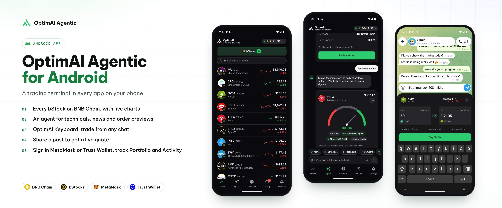
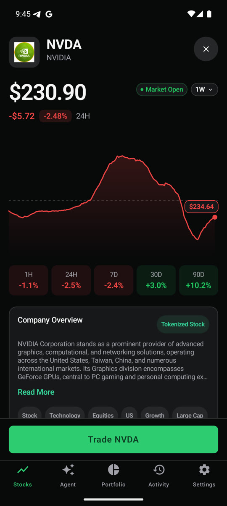
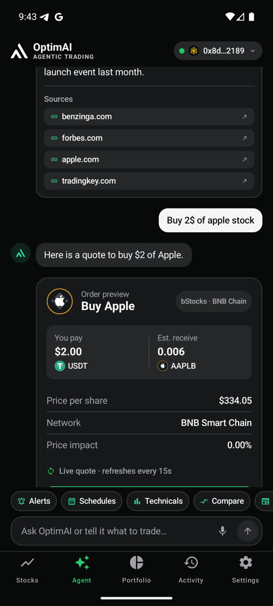
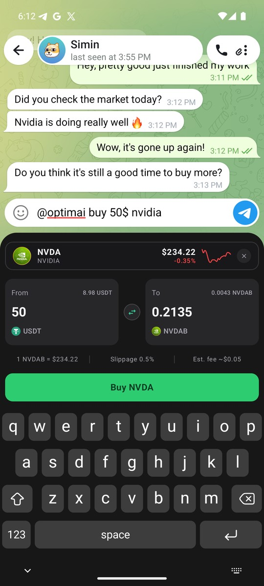
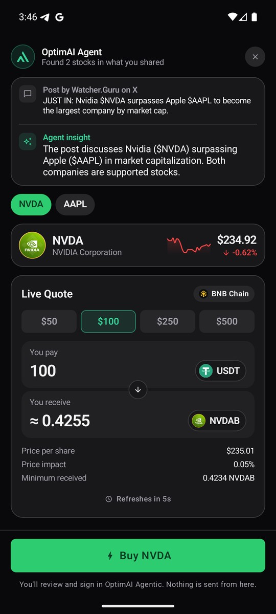
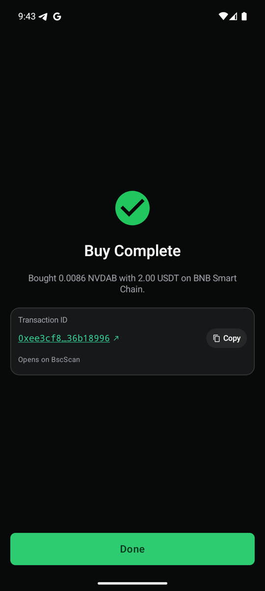
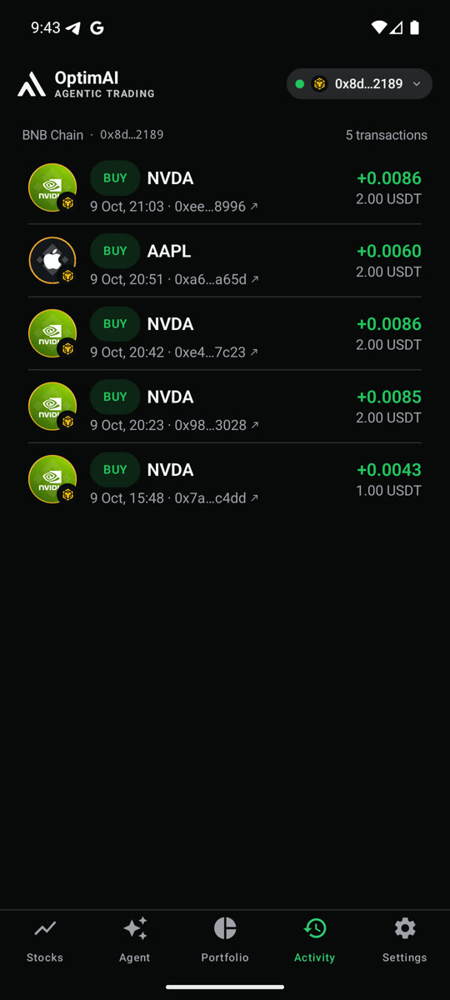

# OptimAI Agentic for Android

<p align="center">
  
</p>

The Android app of OptimAI Agentic, written in Kotlin with Jetpack Compose. It lets you browse tokenized stocks, ask an AI agent about them and trade them from your own wallet. Built for **BNB Hack: Tokenized Stocks Edition** on **BNB Chain with bStocks**. Trades go through PancakeSwap and are signed in **MetaMask** or **Trust Wallet**, connected over WalletConnect (Reown).

**[Download APK v1.0.0](https://github.com/OptimaiNetwork/optimai-agentic-android/releases/download/v1.0.0/OptimAI-Agentic-Android-1.0.0.apk)** |
**[Chrome extension](https://github.com/OptimaiNetwork/optimai-agentic-extension)**

## Quick start

1. Install `OptimAI-Agentic-Android-1.0.0.apk` from the link above on a phone or emulator with Android 8.0 or newer (or `adb install OptimAI-Agentic-Android-1.0.0.apk`). The APK is signed with a debug certificate for sideloading, so uninstall any earlier build signed with a different key first.
2. Open the app. The Stocks tab lists every bStock on BNB Chain.
3. To trade, open **Settings**, tap **Connect Wallet** and approve in MetaMask or Trust Wallet on BNB Smart Chain.
4. To use the keyboard, open **Settings > Extensions > OptimAI Keyboard**, turn it on and switch to it, then type `@optimai buy 50$ nvidia` in any chat.
5. To trade from a post, share it from any app and pick **Trade with OptimAI**.

To build it yourself, see [Build and run](#build-and-run).

## Features

The app ships four components: the main app, the OptimAI Keyboard, a share target and the wallet connection.

### Stocks and charts

The bStocks catalog with search, and a detail screen per stock with charts and stats.

<p align="center">
  
</p>

### Agent chat

An agent chat with technical analysis cards. Ask for an order and it prepares a preview with a live quote.

<p align="center">
  
</p>

### OptimAI Keyboard

A full keyboard with a live bStocks ticker toolbar on top. Type "@optimai buy 50$ nvidia" in any chat and it shows a trade card; ask a question such as "@optimai recent news of nvidia?" and tap the glowing OptimAI logo to read the answer inside the keyboard.

<p align="center">
  
</p>

### Share target

Share a post or a link from any app and pick "Trade with OptimAI". The app reads the post, lists the stocks it mentions and opens a buy quote.

<p align="center">
  
</p>

### Buy in your wallet

A quote screen that runs the whole PancakeSwap flow (approve, swap, receipt). Connect MetaMask or Trust Wallet through Reown. Every order is signed and broadcast by your wallet; the app never holds a key.

<p align="center">
  
</p>

### Portfolio and activity

A portfolio and an activity log of every order, each with its BscScan link.

<p align="center">
  
</p>

## How it works

<details>
<summary>The OptimAI Keyboard</summary>

The keyboard is drawn from scratch to match the iOS system keyboard, using measurements taken from iOS 26 screenshots (keys of 33.5 by 43.3 pt, 6.67 pt gaps, 56 pt rows, key color `#3D3D3D` on `#171717`).

- QWERTY, 123 and #+= layouts as on iOS. A letter is typed when the finger lifts; when a second finger lands, the first finger's letter is typed at once. Fingers can slide between keys, and sliding from "123" to a symbol and releasing types that one symbol and returns to letters.
- An enlarged callout on press, and a long press on symbol keys to pick variants (for example currency signs and quotes).
- Shift for one letter, double tap for caps lock, automatic capitals at the start of a sentence depending on the field, and double tap on space for ". ".
- Holding delete removes characters, then whole words. Holding space moves the cursor like a trackpad.
- The return key follows the field (`search`, `go`, `send` or `done` in blue, `↵` for a new line). Number fields open on the 123 layout.
- Toolbar: a scrolling bStocks ticker, a banner and a trading card (From and To, swap direction, number pad, Buy or Sell opens the app's quote screen). It detects "@optimai ..." on the device using an alias table.

Unlike iOS, the row with the globe and microphone under the keys is not drawn: on Android that space belongs to the system navigation bar (hide keyboard and switch keyboard). Typing sounds and vibration follow the system settings.

</details>

## Build and run

Requirements:

* JDK 17 (the JDK bundled with Android Studio works) and the Android SDK. In the SDK Manager install **Android SDK Platform 36** and the **Build-Tools** it offers (Android Studio does this on first sync).
* A [Reown](https://cloud.reown.com) project id. Wallet connections (MetaMask, Trust Wallet) do not work without one. Create a free project at cloud.reown.com and copy its project id.

Configure the build:

1. Copy `local.properties.example` to `local.properties` (it is gitignored).
2. `sdk.dir`: Android Studio writes it for you when you open the project. For command line builds, set `sdk.dir` in `local.properties` or export `ANDROID_HOME` to your SDK path.
3. Fill in your Reown project id:

   | Key | What it is |
   | --- | --- |
   | `reown.projectId` | Your Reown project id. Required for wallet connect. |

   It can also come from the `REOWN_PROJECT_ID` environment variable.

Start an emulator (Android Studio Device Manager) or connect a device with USB debugging on, then:

```bash
./gradlew :app:installDebug
```

If `java` is not on your path, point `JAVA_HOME` at the JDK bundled with Android Studio first. Gradle installs nothing without a running emulator or device.

### Enable the keyboard with adb

```bash
adb shell ime enable com.test.agenttrade/.keyboard.OptimAIKeyboardService
adb shell ime set com.test.agenttrade/.keyboard.OptimAIKeyboardService
```

Notes for the emulator:

- The emulator has a hardware keyboard, so Android hides soft keyboards. Turn them on with `adb shell settings put secure show_ime_with_hard_keyboard 1`.
- Each reinstall of the APK switches Android back to the default keyboard. Run the `ime set` command above again.
- Debug builds have **Settings > Developer > Simulated wallet** to try the wallet flow without MetaMask or Trust Wallet. The simulated wallet signs nothing and records no trade.

## Project layout

| Folder | Contents |
| --- | --- |
| `keyboard/` | The OptimAI Keyboard: key grid, input engine and ticker toolbar |
| `ui/stocks/` | Stock list and stock detail |
| `ui/quote/QuoteBuyScreen.kt` | PancakeSwap quote, approve, swap and receipt |
| `ui/agent/` | Agent chat and technical analysis cards |
| `ui/portfolio/` | Portfolio and activity |
| `ui/settings/` | Settings, how it works and the guide pages |
| `share/ShareActivity.kt` | The "Trade with OptimAI" share target |
| `wallet/` | WalletConnect (Reown) session and signing |
| `data/` | API client, DTOs and user facing errors |
| `ui/theme/`, `ui/components/` | Design system and shared components |

## License

MIT, see [LICENSE](LICENSE). Bundled logos, the keyboard alternate keys table and library licenses are listed in [THIRD_PARTY_NOTICES.md](THIRD_PARTY_NOTICES.md).
